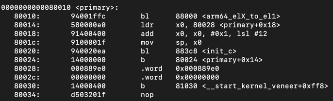

# 实验1：机器启动
> 思考题 1：阅读 _start 函数的开头，尝试说明 ChCore 是如何让其中一个核首先进入初始化流程，并让其他核暂停执行的。

```
BEGIN_FUNC(_start)
    mrs	x8, mpidr_el1       /* 将core ID存入x8*/
    and	x8, x8,	#0xFF       /* 只保留x8的低8位 */
    cbz	x8, primary         /* 判断低八位是否为0, 若为0，则跳转到 primary */

	b	.   /*如果不是，挂起*/
END_FUNC(_start)
```
先将核的core ID存入x8中，再用0xFF去mask，即取x8的低八位。然后将x8的值与0比较（mpidr_el1低8位是Affinity level 0），若满足core ID的低八位为0，才跳转到primary进行初始化，不满足的核则挂起。

> 练习题 2：在 `arm64_elX_to_el1` 函数的 `LAB 1 TODO 1` 处填写一行汇编代码，获取 CPU 当前异常级别。

通过`CurrentEL`系统寄存器获得当前异常级别，并存入x9。

```
mrs x9, CURRENTEL
```

> 练习题 3：在 `arm64_elX_to_el1` 函数的 `LAB 1 TODO 2` 处填写大约 4 行汇编代码，设置从 EL3 跳转到 EL1 所需的`elr_el3`和`spsr_el3`寄存器值。具体地，我们需要在跳转到 EL1 时暂时屏蔽所有中断、并使用内核栈（`sp_el1`寄存器指定的栈指针）。

将 EL3 的返回地址设置为`.Ltarget`，将 EL3 的状态寄存器设置为`SPSR_ELX_DAIF | SPSR_ELX_EL1H`。其中，`SPSR_ELX_DAIF`用来屏蔽所有中断，`SPSR_ELX_EL1H`用来设置内核栈。

```
adr x9, .Ltarget
msr elr_el3, x9
mov x9, SPSR_ELX_DAIF | SPSR_ELX_EL1H
msr spsr_el3, x9
```

> 思考题 4：结合此前 ICS 课的知识，并参考 `kernel.img` 的反汇编（通过 `aarch64-linux-gnu-objdump -S` 可获得），说明为什么要在进入 C 函数之前设置启动栈。如果不设置，会发生什么？

因为C函数会将参数和局部变量存放在栈中，进行压栈。

如果不设置，栈地址为 0x0，C函数向下压栈时，会导致内存非法访问，造成C函数执行失败。



> 思考题 5：在实验 1 中，其实不调用 `clear_bss` 也不影响内核的执行，请思考不清理 `.bss` 段在之后的何种情况下会导致内核无法工作。

`.bss`段存储未初始化的全局变量或者已经初始化为零的变量。如果不清理，未初始化的变量可能会存在未知的数值，从而在下一次启动时存在未初始化的变量不为0，引发bug，导致内核无法工作。


> 练习题 6：在 `kernel/arch/aarch64/boot/raspi3/peripherals/uart.c` 中 `LAB 1 TODO 3` 处实现通过 UART 输出字符串的逻辑。

遍历字符串，调用`early_uart_send()`将字符挨个输出。

```
char *p = str;
while (p){
    early_uart_send(*p);
    p ++;
}
```

> 练习题 7：在 `kernel/arch/aarch64/boot/raspi3/init/tools.S` 中 `LAB 1 TODO 4` 处填写一行汇编代码，以启用 MMU。

设置`sctlr_el1`寄存器的M域（`bit[0]`）为1，启动MMU。

```
orr x8, x8, #SCTLR_EL1_M
```