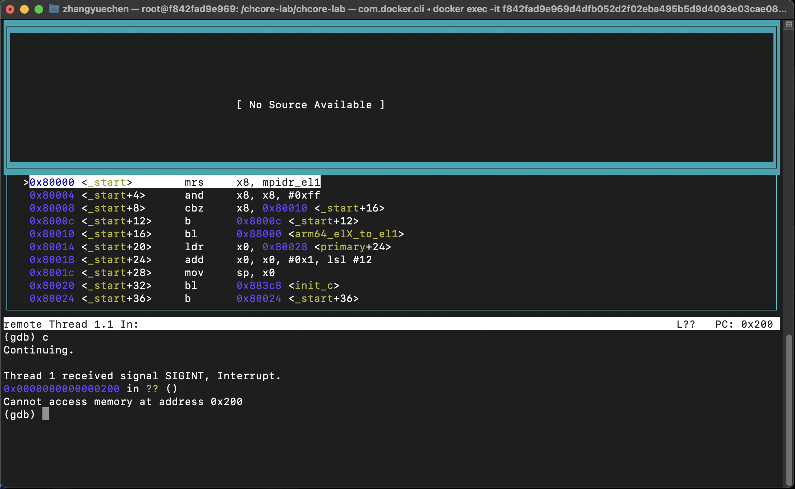

# 实验 2：内存管理

> 思考题 1：请思考多级页表相比单级页表带来的优势和劣势（如果有的话），并计算在 AArch64 页表中分别以 4KB 粒度和 2MB 粒度映射 0～4GB 地址范围所需的物理内存大小（或页表页数量）。

+ 优势：多级页表能够显著地压缩页表大小,节省内存；
+ 劣势：增加寻址次数，导致地址翻译时长的增加；

1. 4KB:

   页表页数量：1(L0) + 1(L1) + 4(L2) + 4 * 512(L3) = 1 + 1 + 4 + 2048 = 2054

2. 2MB

   页表页数量：1(L0) + 1(L1) + 4(L2) = 6

> 思考题 3：请思考在 `init_boot_pt` 函数中为什么还要为低地址配置页表，并尝试验证自己的解释。

因为在启用MMU后、跳转到高地址之前程序仍运行在低地址，如果不为低地址配置页表，会导致启用MMU后低地址无法映射，无法正常跳转到低地址的函数。

验证：

将为低地址配置页表的代码注释掉，在qemu中continue执行，待内核输出停止后，按Ctrl-C中断，会发现程序在0x200处无限循环，即进入进入translation fault的死循环。



> 思考题 4：请解释 `ttbr0_el1` 与 `ttbr1_el1` 是具体如何被配置的，给出代码位置，并思考页表基地址配置后为何需要ISB指令。

在kernel/arch/aarch54/boot/raspi3/init/tools.S，el1_mmu_activate函数中。

完成 `init_boot_pt` 函数后，在 `el1_mmu_activate` 中将boot_ttbr0_l0、boot_ttbr1_l0数组分别放入ttbr0_el1、ttbr1_el1寄存器中。

```asm
/* Write ttbr with phys addr of the translation table */
adrp    x8, boot_ttbr0_l0
msr     ttbr0_el1, x8
adrp    x8, boot_ttbr1_l0
msr     ttbr1_el1, x8
isb
```

ISB指令会刷新处理器中的管道，可以确保所有在ISB指令之后的指令都从指令高速缓存或内存中重新预取。页表基地址配置后使用ISB指令，可以确保提取时间晚于ISB指令的指令能够检测到ISB指令执行前就已经执行的上下文更改操作的执行效果，即页表基地址配置。

> 思考题 8：阅读 Arm Architecture Reference Manual，思考要在操作系统中支持写时拷贝（Copy-on-Write，CoW）需要配置页表描述符的哪个/哪些字段，并在发生缺页异常（实际上是 permission fault）时如何处理。

AP字段。

发生缺页异常后，CPU会将控制流传递给操作系统预先设置的异常处理函数。在函数中，操作系统会发现当前异常是由于应用程序写了只读内存，而相应的内存区域又被标记成写时拷贝。于是，操作系统会将缺页异常对应的物理页重新拷贝一份，并将新拷贝的物理页以可读可写的方式重新映射给触发异常的应用程序，再恢复应用程序的执行。

> 思考题 9：为了简单起见，在 ChCore 实验中没有为内核页表使用细粒度的映射，而是直接沿用了启动时的粗粒度页表，请思考这样做有什么问题。

1. 增加系统管理内存的复杂度；
2. 产生更多碎片，造成物理内存资源浪费。